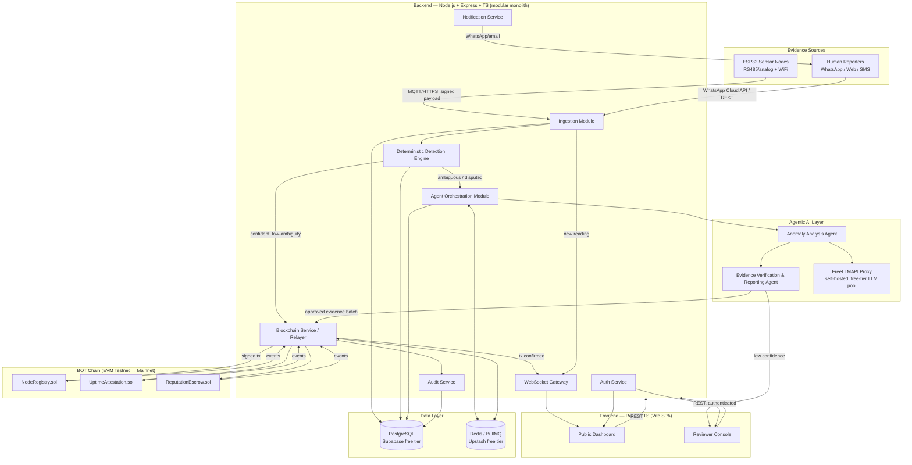
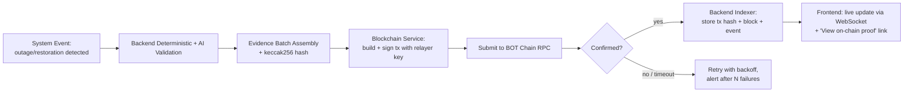
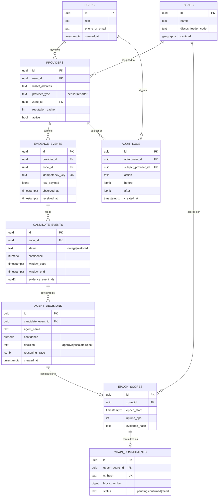
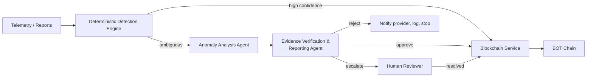
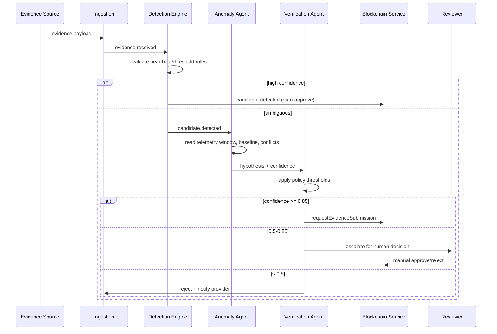
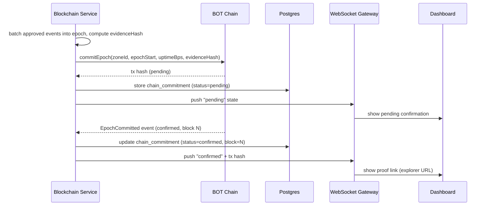
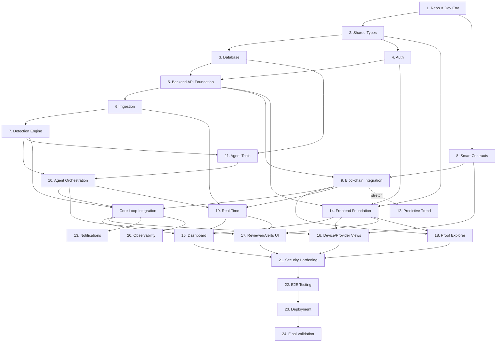

# GridProof — Verified Grid Power-Uptime DePIN Network
## Complete System Architecture & Autonomous-Coding-Agent Build Plan

**Prepared for:** BOT Chain Africa Builder Challenge — Ogbomoso Demo Day, August 13, 2026
**Team:** 4 builders (embedded systems, Solidity, AI, product/design)
**Stack:** TypeScript, React, Node.js, Express, BOT Chain (EVM-compatible L1), free-tier-first infrastructure

---

## How to read this document

This is both a system-design document and an execution manual. Parts 1–11 are the architecture. Part 12 turns it into a phased roadmap. Part 13 gives copy-paste-ready prompts for an autonomous coding agent (e.g. Claude Code) for every phase. Part 14 shows what can be built in parallel by a 4-person team. Part 15 records the trade-offs behind every major decision.

**Working assumption (stated explicitly, since it wasn't restated in the brief passed to me):** the project is *GridProof* — a DePIN network that produces cryptographically-anchored, tamper-evident records of electricity grid uptime/downtime per feeder-zone in Nigeria, verified by an AI-assisted evidence pipeline, with proof commitments written to BOT Chain. This matches the top-recommended idea for this challenge: ESP32 sensor nodes + AI verification + BOT Chain smart contracts, **with a non-hardware fallback (human-reporter escrow + reputation network) if the ESP32 telemetry pipeline isn't demo-ready.** If the actual project differs, the architecture in Parts 4–11 (backend, AI, frontend, security) still applies almost unchanged — only Part 3's evidence-source contracts and Part 2's ingestion layer would need renaming.

**The single most important architectural decision in this document, given your timeline:** the hardware/fallback decision doesn't have to be a fork of the system. It's designed as a **swap of one component** (the "Evidence Source"), not a rewrite. See Part 1 and Part 2. This means your team can keep building the other 90% of the system in parallel while the hardware track is derisked, and can flip modes as late as the day before demo without breaking anything downstream.

---

# PART 1 — PROJECT ANALYSIS

### Core problem
Nigerian electricity consumers and DisCos have no independent, trustworthy, tamper-evident record of *actual* grid uptime per feeder/zone. Outage claims are anecdotal, unverifiable, and easy to dispute. GridProof creates a public, cryptographically-verifiable ledger of uptime/downtime events, resistant to a single party (DisCo, individual reporter, or node operator) rewriting history.

### Primary actors
| Actor | Role |
|---|---|
| **Sensor Node Operator** | Owns/hosts an ESP32 node wired to a ZMPT101B/ZMCT-style voltage sensor on a feeder; earns reputation/rewards for uptime and honest telemetry. |
| **Human Reporter** (fallback mode) | Submits outage/restoration reports for their feeder zone via WhatsApp/web/SMS; stakes reputation on accuracy. |
| **Verifier (AI + deterministic engine)** | Cross-checks incoming evidence against baselines and other independent sources before it's eligible for on-chain commitment. |
| **Relayer (backend service)** | The only actor with a blockchain signing key; submits verified evidence batches on behalf of the network. |
| **Reviewer (human-in-the-loop)** | Resolves low-confidence or disputed cases the AI agent escalates. |
| **Public / DisCo / Researcher / Judge** | Consumes the dashboard and on-chain proofs; needs no account for read access. |

### Major capabilities
1. Ingest uptime evidence (sensor telemetry **or** human reports) per zone.
2. Deterministically detect outage/restoration events and score confidence.
3. Use an AI agent to reason over ambiguous/disputed cases and produce human-readable evidence summaries.
4. Commit evidence hash + zone uptime score to BOT Chain on a fixed epoch cadence.
5. Reward/slash reputation and stake based on verified accuracy.
6. Present a public dashboard: live map, uptime %, alerts, and a block-explorer-style "proof" view per event.

### Functional requirements (in scope for demo)
- Node/reporter registration and identity.
- Telemetry or report ingestion with validation.
- Outage/restoration detection with confidence scoring.
- AI-assisted evidence review with escalation to humans below a confidence threshold.
- Epoch-based on-chain commitment of evidence hashes + zone scores.
- Public dashboard with live status, history, and on-chain proof lookup.
- Reputation/stake accounting (escrow contract) for the fallback mode; reward-eligibility accounting for hardware mode.

### Non-functional requirements
- **Demo feasibility over enterprise scale.** Must run end-to-end live on stage with real or replayed data by Aug 13.
- **Free-tier-first**: every layer must have a $0 path from now through demo day (explicit ask; see Part 15 ADRs).
- **Graceful AI degradation**: since the AI layer runs on free-tier LLM capacity, the system must keep functioning (deterministic-only mode) if the LLM provider is slow, rate-limited, or down.
- **Tamper evidence, not full decentralization.** A hackathon relayer-based design is acceptable; full decentralized oracle networks are explicitly out of scope (see Part 15).
- **Auditability**: every state change that affects reputation, stake, or on-chain data must be traceable end-to-end (off-chain reasoning → on-chain hash).

### Constraints
- 5-day build window (Aug 8 → Aug 13), 4-person team, hardware availability uncertain until ~Aug 9.
- BOT Chain is a new, EVM-compatible L1 (confirmed: Solidity, standard EVM tooling, in-browser + Hardhat/Foundry-style deployment, contract verification, block explorer). Treat it like any EVM testnet for tooling purposes; **pull the actual RPC URL, chain ID, and faucet link from the official BOT Chain hackathon docs given to you** — don't hardcode guessed values.
- Team must not need to pay for infrastructure before/through the demo.

### Trust boundaries
- **Sensor/reporter → backend**: untrusted input. Every payload is validated, rate-limited, and signed (device keypair or reporter session) before it touches the detection engine.
- **Backend → AI agent**: the agent is untrusted with side effects. It can read telemetry/report data and *propose* actions; it cannot call the blockchain, cannot mutate reputation/stake directly, and cannot bypass the deterministic confidence gate.
- **Backend → blockchain**: only one service (the Blockchain/Relayer Service), holding one operational key (ideally a hot wallet with tight spend/role limits, backed by a cold multisig owner key), may submit transactions.
- **Frontend → backend**: standard authenticated API boundary; all writes are re-validated server-side regardless of client-side checks.

### Security requirements (summary — full detail in Part 9)
RBAC on every contract and every internal API; no private keys in the AI agent's reach; input validation on all ingestion endpoints; rate limiting per device/reporter; audit log of every agent decision; secrets never committed, loaded from environment/secret manager.

### Blockchain requirements
EVM-compatible contracts in Solidity, deployable to BOT Chain testnet now and mainnet post-validation; on-chain footprint minimized to hashes/scores/roles (Part 3); standard wallet (MetaMask) support for judges/public verification.

### AI/agentic requirements
One deterministic detection engine (not an agent) + two narrowly-scoped LLM agents with hard guardrails (Part 6). LLM calls routed through a self-hosted **FreeLLMAPI** proxy so the team is not blocked by any single provider's free-tier limits, with a documented one-line swap to a paid key post-hackathon.

### Real-time requirements
Live dashboard updates (new event, new on-chain confirmation) via WebSocket; sub-5-second latency from detection to dashboard update is a nice-to-have, not a hard requirement (blockchain confirmation is the actual bottleneck).

### Data requirements
Telemetry/report volume for a demo is small (a handful of nodes/reporters, days of data) — this rules out needing a specialized time-series database (see Part 15 ADR on TimescaleDB).

### External integrations
BOT Chain RPC/faucet/explorer; FreeLLMAPI (self-hosted, backed by free-tier LLM providers); WhatsApp Business Cloud API or Twilio (free trial credit) for human-reporter ingestion in fallback mode; MetaMask for wallet interaction.


---

# PART 2 — COMPLETE SYSTEM ARCHITECTURE

### The key design move: an "Evidence Source" abstraction

Both operating modes (hardware sensors vs. human-reporter escrow) produce the same shape of data: *"zone Z, time T, status U, submitted-by W, signature/proof P."* Everything downstream — detection, AI review, blockchain commitment, dashboard — consumes that shape and doesn't need to know where it came from. So the ingestion layer defines one interface, `EvidenceSource`, with two implementations:

- `SensorEvidenceSource` — MQTT/HTTPS ingest from ESP32 nodes.
- `ReporterEvidenceSource` — WhatsApp/web-form ingest from human reporters, with the escrow/reputation contract governing who's allowed to report and what they have at stake.

A `MODE` environment flag on the backend picks which source(s) are active (they can even both be active — "hybrid" — if only some zones have hardware). This is the difference between a 5-day team building one system with a late-breaking config decision, versus two systems.

### High-level architecture



### Component responsibilities

| Component | Responsibility | Inputs | Outputs | Protocol | Failure handling |
|---|---|---|---|---|---|
| **Ingestion Module** | Validate, deduplicate, rate-limit, and normalize evidence from either source into a common `EvidenceEvent` shape | Raw MQTT/HTTP payloads | `EvidenceEvent` rows | MQTT (sensors), REST/webhook (reporters/WhatsApp) | Reject malformed payloads with 4xx; queue valid-but-late events; idempotency key prevents duplicate ingestion |
| **Detection Engine** | Deterministic rules/stats: heartbeat-gap detection, threshold crossing, cross-source agreement scoring | `EvidenceEvent` stream | `CandidateEvent` (status change + confidence score) | In-process / BullMQ job | Never blocks on AI; always produces a result using rules alone |
| **Agent Orchestration Module** | Routes ambiguous `CandidateEvent`s to the AI agents, enforces confidence gate, applies timeouts | `CandidateEvent` | `AgentDecision` | Internal function calls + BullMQ | On LLM timeout/error, falls back to "escalate to human review" — never silently drops or silently auto-approves |
| **Blockchain Service (Relayer)** | The only component that signs transactions; batches evidence hashes per epoch, submits, tracks confirmation, indexes events back | Approved `AgentDecision`/`CandidateEvent` | Signed tx, indexed on-chain events | ethers.js → BOT Chain RPC | Retries with backoff; nonce management; on repeated failure, alerts + queues for manual resubmission |
| **Notification Service** | Sends WhatsApp/email updates to reporters and alerts to reviewers | Domain events | Outbound messages | WhatsApp Cloud API / SMTP | Best-effort, non-blocking; failures logged, never block core flow |
| **Auth Service** | Session/JWT issuance, role assignment (public / reporter / reviewer / admin) | Credentials | Session tokens | REST, Supabase Auth | Standard lockout/rate-limit on failed attempts |
| **Audit Service** | Immutable log of every state transition that touches reputation, stake, or chain submission | All module outputs | Append-only audit rows | Internal | Write-behind queue; audit failures alert but don't block the primary action (logged for reconciliation) |
| **WebSocket Gateway** | Pushes live updates to the dashboard | Domain events | `event`, `confirmation`, `alert` messages | Socket.io | Client auto-reconnect + REST fallback if socket drops |

### Data flow (typical event)
1. Evidence arrives (sensor reading or reporter message) → Ingestion validates + stores raw record.
2. Detection Engine evaluates against baseline; if unambiguous (e.g., long stable heartbeat vs. clean multi-minute silence), confidence is high → goes straight to Blockchain Service queue.
3. If ambiguous (single source, borderline threshold, conflicting reports) → Agent Orchestration invokes the Anomaly Analysis Agent, then the Evidence Verification Agent.
4. If agent confidence ≥ threshold → approved for on-chain commitment. If below threshold → routed to the Reviewer Console.
5. Blockchain Service batches approved events per epoch (e.g., every 10–15 minutes, not per-event, to keep gas/API usage low) and submits one transaction per zone per epoch.
6. On confirmation, the event is indexed back into Postgres and pushed to the dashboard via WebSocket, with a link to the on-chain proof.

---

# PART 3 — BOTCHAIN SMART-CONTRACT ARCHITECTURE

### On-chain vs. off-chain split

| Data | Location | Why |
|---|---|---|
| Raw telemetry / raw reporter messages | Off-chain (Postgres) | High volume, no need for global consensus on raw sensor noise |
| AI agent reasoning traces, prompts, confidence scores | Off-chain (Postgres) | Large, unstructured, not meant to be a public commitment target — only the *conclusion* is committed |
| Per-epoch, per-zone uptime score + evidence-batch hash (keccak256 of the batch) | **On-chain** | This is the actual trust artifact: small, fixed-size, and exactly what needs to be tamper-evident |
| Node/reporter identity, public key, zone assignment | **On-chain** (registry) | Needs to be globally verifiable and censorship-resistant |
| Stake and reputation balances | **On-chain** (escrow) | Financial/reputational state must be trustlessly enforced |
| PII (phone numbers, names) | Off-chain only, never hashed into on-chain payloads | Privacy; on-chain identity is a wallet address + pseudonymous zone/reporter ID |

### Contracts

**1. `NodeRegistry.sol`**
- *Purpose*: register sensor nodes or human reporters as "Evidence Providers" for a zone.
- *State*: `mapping(address => Provider)`, `struct Provider { bytes32 zoneId; uint8 providerType; uint64 registeredAt; bool active; }`
- *Events*: `ProviderRegistered`, `ProviderDeactivated`
- *Functions*: `register(bytes32 zoneId, uint8 providerType)`, `deactivate(address provider)` (admin/self)
- *Roles*: `DEFAULT_ADMIN_ROLE` (multisig), provider self-service for registration
- *Validation*: one active registration per address per zone; zone ID must exist in a small on-chain zone allowlist (or off-chain-governed list, admin-added)

**2. `UptimeAttestation.sol`**
- *Purpose*: the core append-only ledger of verified uptime evidence.
- *State*: `mapping(bytes32 => Epoch) epochs` where `struct Epoch { bytes32 zoneId; uint64 epochStart; uint16 uptimeBps; bytes32 evidenceHash; address submittedBy; }` (`uptimeBps` = uptime in basis points, 0–10000, avoids floats on-chain)
- *Events*: `EpochCommitted(zoneId, epochStart, uptimeBps, evidenceHash)`
- *Functions*: `commitEpoch(bytes32 zoneId, uint64 epochStart, uint16 uptimeBps, bytes32 evidenceHash)` — **RELAYER_ROLE only**
- *Validation*: reject duplicate `(zoneId, epochStart)` (replay protection), `uptimeBps <= 10000`, `epochStart` must be a past, aligned epoch boundary
- *Duplicate/replay protection*: composite key uniqueness check at contract level, **plus** an idempotency key check in the backend before ever building the transaction (belt and suspenders — see Part 4)

**3. `ReputationEscrow.sol`**
- *Purpose*: stake, reward, and slash logic — primarily for the human-reporter fallback mode, but reusable to economically incentivize honest hardware operators too.
- *State*: `mapping(address => uint256) stakes`, `mapping(address => int256) reputationScore`
- *Events*: `Staked`, `Rewarded`, `Slashed`, `Withdrawn`
- *Functions*: `stake()` (payable, or ERC-20 stake token), `reward(address provider, uint256 amount, bytes32 evidenceHash)` (RELAYER_ROLE), `slash(address provider, uint256 amount, bytes32 reasonHash)` (RELAYER_ROLE, requires prior governance/admin-approved policy), `withdraw(uint256 amount)` (self, subject to a cool-down and minimum-stake floor while `active` in `NodeRegistry`)
- *Access control*: `RELAYER_ROLE` can only move funds that are already logically earmarked (reward pool) or slash amounts within a policy cap set by `DEFAULT_ADMIN_ROLE` — the relayer cannot arbitrarily drain stakes.

**4. `DisputeWindow.sol`** *(stretch goal, not demo-critical)*
- *Purpose*: a short challenge window after `EpochCommitted` during which any staked participant can flag a specific epoch as disputed, freezing its reward eligibility pending reviewer/admin resolution. Keep this as a Phase-13+ addition; do not build before the core loop works end-to-end.

### Relationships
`NodeRegistry` is the source of truth for "who is allowed to be evidence for a zone." `UptimeAttestation` references providers only indirectly (via `submittedBy` = the relayer, not the raw sensor/reporter — individual attribution stays off-chain, aggregated evidence is what's committed). `ReputationEscrow` reads `NodeRegistry.active` before allowing stake/withdraw actions and is written to only by the relayer, driven by outcomes recorded in `UptimeAttestation`.

### Transaction lifecycle



### Wallet, roles, gas, and safety
- **Wallet interactions**: reviewers/judges connect MetaMask read-only, to independently verify contract state on the BOT Chain explorer — the public never needs a wallet to *view* proofs.
- **Contract ownership**: `DEFAULT_ADMIN_ROLE` held by a 2-of-3 (or higher, if the team can set it up in time) multisig across teammates, not a single EOA — even for a hackathon, don't put admin on one laptop's key.
- **RBAC**: OpenZeppelin `AccessControl` — `ADMIN_ROLE`, `RELAYER_ROLE` (the backend hot wallet), `PAUSER_ROLE` (emergency stop, admin-assignable).
- **Transaction signing**: only the Blockchain Service signs, using a hot wallet funded minimally from the testnet faucet; never expose this key to the AI agent, the frontend, or logs.
- **Gas**: batch commitments per epoch (not per raw reading) to keep transaction count low; BOT Chain's stated near-zero-fee, sub-second-finality design (per public materials) makes this comfortable even at higher frequency, but batching is still the right default to avoid nonce race conditions from concurrent zones.
- **Replay/duplicate protection**: `(zoneId, epochStart)` uniqueness on-chain + idempotency key off-chain (Part 4) + nonce management in the relayer queue (single writer, sequential nonce assignment).
- **Oracle requirements**: none for the MVP — the backend *is* the oracle, and its trust comes from the deterministic+AI+audit-log pipeline, not from a third-party oracle network. State this explicitly to judges as a deliberate, documented trust boundary, not an oversight.
- **Event indexing**: the Blockchain Service subscribes to contract events (via WS RPC subscription or polling `eth_getLogs` if the BOT Chain RPC doesn't support the newer methods — verify against the actual RPC docs) and reconciles them into Postgres.
- **Testing**: Hardhat + Chai unit tests for every function (happy path, access-control revert, replay revert, boundary values); a local Hardhat network for fast iteration, BOT Chain testnet for integration tests.
- **Deployment / testnet → mainnet workflow**: deploy scripts parameterized by network config (`hardhat.config.ts` networks: `local`, `botchainTestnet`, `botchainMainnet`); testnet deployment is the demo target; mainnet deployment is a Part-12 Phase-14 stretch goal, gated on judge/track requirements.

### Recommended contract directory structure
```text
packages/contracts/
  contracts/
    NodeRegistry.sol
    UptimeAttestation.sol
    ReputationEscrow.sol
    DisputeWindow.sol           # stretch
    interfaces/
      INodeRegistry.sol
      IUptimeAttestation.sol
    libraries/
      EpochMath.sol
  scripts/
    deploy.ts
    seed-zones.ts
  test/
    NodeRegistry.test.ts
    UptimeAttestation.test.ts
    ReputationEscrow.test.ts
  hardhat.config.ts
  package.json
```

---

# PART 4 — BACKEND ARCHITECTURE

### Architecture style: modular monolith (not microservices)

**Decision**: one Node.js/Express/TypeScript service, internally organized into strict modules with clear boundaries (as if they were future microservices), communicating in-process via function calls for synchronous work and BullMQ (Redis-backed) for asynchronous/deferred work (AI review, blockchain submission, notifications).

**Why**: a 4-person team has one backend engineer's worth of bandwidth for this layer; microservices would add network hops, multiple deployments, and multiple free-tier services to babysit — pure overhead for a 5-day build with a single demo instance. A modular monolith gets 90% of the benefit (clear separation of concerns, independent testability) with 10% of the operational cost, and the module boundaries mean it *can* be split later if GridProof continues past the hackathon.

### Backend modules

| Module | Responsibilities | Key endpoints | Emits | Consumes |
|---|---|---|---|---|
| `auth` | Login, session, role assignment (public/reporter/reviewer/admin) | `POST /auth/login`, `POST /auth/register`, `GET /auth/me` | `user.registered` | — |
| `ingestion` | Validate + normalize evidence from both sources | `POST /ingest/telemetry` (sensor, HMAC-signed), `POST /ingest/whatsapp-webhook`, `POST /ingest/report` (web form) | `evidence.received` | — |
| `detection` | Deterministic outage/restoration detection + confidence scoring | (internal — triggered by `evidence.received`) | `candidate.detected` | `evidence.received` |
| `agent-orchestration` | Routes candidates to AI agents, enforces gates/timeouts | `GET /admin/review-queue`, `POST /admin/review/:id/decision` | `agent.decision`, `review.required` | `candidate.detected` |
| `blockchain` | Signs and submits transactions, indexes confirmations | `GET /chain/proof/:zoneId/:epoch`, (internal submit queue) | `chain.committed` | `agent.decision` (approved) |
| `notification` | WhatsApp/email delivery | (internal) | — | `chain.committed`, `review.required` |
| `zones` / `nodes` | Zone + provider registry mirror (reads registry contract, caches locally) | `GET /zones`, `GET /nodes/:id` | — | `chain.committed` (registry events) |
| `audit` | Append-only log of every module's key decisions | (internal, write-only from other modules) | — | all |
| `realtime` (WebSocket gateway) | Broadcasts domain events to connected dashboards | WS `/realtime` | — | `evidence.received`, `chain.committed`, `review.required` |

### API architecture
- **REST** (Express + Zod-validated request/response schemas) for all CRUD and command endpoints, versioned under `/api/v1/...`.
- **WebSockets** (Socket.io) for live dashboard updates only — never for commands (commands always go through REST so they're auditable/retryable).
- **Webhooks**: inbound from WhatsApp Cloud API (`POST /ingest/whatsapp-webhook`, verified via the provider's signing secret).
- **Internal service interfaces**: modules call each other through typed function interfaces exported from each module's `index.ts` — not HTTP — to keep the monolith fast and simply testable; the event names above (`evidence.received`, etc.) are emitted on a small in-process `EventEmitter` for modules that shouldn't be tightly coupled, with BullMQ used specifically for the two integrations that must survive a process restart (AI agent calls, blockchain submission).
- **Idempotency**: every ingestion and submission endpoint requires/generates an idempotency key (`deviceId+timestamp` hash, or `reportId`) stored in Postgres with a unique constraint, so retries (from flaky ESP32 WiFi, or WhatsApp webhook redelivery) never double-count.
- **Validation & versioning**: Zod schemas colocated with each route, shared types published from `packages/shared-types` (Part 11) so frontend and backend can't drift.

### Error handling & retries
- Ingestion: malformed payload → `400` with structured error, never silently dropped; logged.
- Agent calls (via FreeLLMAPI): timeout (e.g. 8s) + 1 retry with a different model in the pool if the proxy reports a provider failure (FreeLLMAPI's own failover mostly covers this) → on second failure, auto-escalate to human review rather than blocking.
- Blockchain submission: exponential backoff up to N attempts, then alert + park in a "needs manual resubmit" state — never silently lose an approved evidence batch.
- All retries are logged to the `audit` module with attempt count and final outcome.

---

# PART 5 — DATABASE AND DATA ARCHITECTURE

### Storage technology decision

**PostgreSQL only** (via Supabase's free tier — 500 MB, includes Auth, Realtime, and Storage in the same free project). **No TimescaleDB, no separate vector database, no object-storage service beyond what Supabase Storage already gives you for free.** A demo network of a handful of nodes/reporters over a few days produces at most tens of thousands of rows — plain, well-indexed Postgres handles that trivially. Adding Timescale or a dedicated time-series engine would be optimizing for a scale problem you don't have yet (see Part 15 ADR). Redis (Upstash free tier) is added only for BullMQ queues and lightweight caching/rate-limiting — not as a primary datastore.

### Entities and ERD



### Keys, indexes, retention
- Primary keys: UUID v4 everywhere (avoids leaking sequential counts, safe for client-generated idempotency scenarios).
- Foreign keys: as shown; `ON DELETE RESTRICT` for anything referenced by `AUDIT_LOGS` or `CHAIN_COMMITMENTS` — nothing that's been committed on-chain should ever be hard-deletable off-chain.
- Important indexes: `evidence_events(zone_id, observed_at)`, `evidence_events(idempotency_key)` unique, `candidate_events(zone_id, window_start)`, `chain_commitments(tx_hash)` unique.
- Retention: raw `evidence_events` can be pruned/archived after 90 days for a production version; keep everything through the hackathon. `audit_logs` and `chain_commitments` are never pruned.

### Dataset separation
- **Operational data**: `users`, `providers`, `zones`.
- **Telemetry/evidence data**: `evidence_events`, `candidate_events`.
- **AI/agent data**: `agent_decisions` (includes reasoning traces — off-chain only, never committed verbatim on-chain).
- **Blockchain records**: `epoch_scores`, `chain_commitments` (mirror of on-chain truth, rebuildable from chain if ever lost).
- **Audit logs**: `audit_logs` — cross-cutting, referenced by everything but owned by no domain module.

These interact through the pipeline described in Part 2: evidence → candidate → agent decision → epoch score → chain commitment, with audit logs written alongside every step rather than derived after the fact.

---

# PART 6 — AGENTIC AI ARCHITECTURE

### Why an agent is required at all — and where it stops

Outage detection itself is **not** an LLM problem: "no heartbeat for 6 minutes from a node that normally reports every 60 seconds" is a deterministic rule. Where judgment genuinely helps is the *ambiguous* cases: conflicting reports from two reporters in the same zone, a single-source claim with no corroboration, a sensor reading that's anomalous but could be a wiring fault rather than a real outage. That's a bounded, well-defined reasoning task — a good fit for a narrowly-scoped LLM agent with read-only tools and a hard confidence gate. Everything with an unambiguous deterministic answer should never touch the LLM at all, both for speed and because **you're building on free-tier LLM capacity that can be slow or rate-limited** — the fewer calls you make, and the less the demo depends on them succeeding, the safer you are on stage.

**The agent must never:** hold or use a blockchain private key, directly write to `reputation`/`stake` fields, bypass the deterministic confidence gate, or take any action without its output being schema-validated and audit-logged first.

**Deterministic systems remain outside the agent for:** heartbeat/threshold detection, epoch batching logic, all blockchain transaction construction/signing, all reputation/stake arithmetic (the agent can *recommend* a reward/slash outcome; only policy code applies it).

### Agents (two, deliberately — not more)

**1. Anomaly Analysis Agent**
- *Objective*: given an ambiguous `CandidateEvent`, produce a plain-language root-cause hypothesis and an initial confidence score.
- *Inputs*: the candidate event, the zone's recent telemetry/report window, the zone's historical baseline, provider metadata (reputation, active status).
- *Outputs*: `{ hypothesis: string, confidence: number 0-1, supportingEvidenceIds: uuid[] }` (Zod-validated).
- *Tools available*: `getTelemetryWindow(zoneId, range)`, `getHistoricalBaseline(zoneId)`, `getProviderMetadata(providerId)`, `getConflictingReports(zoneId, range)` — all **read-only**.
- *Memory/state*: stateless per call; all context passed explicitly in the prompt (no persistent agent memory needed at this scale — avoids an unnecessary vector DB dependency).
- *Trigger*: `candidate.detected` event where deterministic confidence is below the auto-approve threshold (e.g. < 0.85) but above the auto-reject floor (e.g. > 0.2).
- *Guardrails*: request timeout from `LLM_TIMEOUT_MS` (default 20 s — a failover router spends real time before first token); single retry; output must validate against schema or the call is treated as a failure (→ escalate to human).

**2. Evidence Verification & Blockchain-Reporting Agent**
- *Objective*: take the Anomaly Analysis Agent's hypothesis + confidence and the deterministic policy rules, decide `approve | escalate | reject`, and if approved, draft the evidence-batch summary and the reporter/provider notification text.
- *Inputs*: `AgentDecision` (partial) from Agent 1, policy thresholds, provider reputation.
- *Outputs*: `{ decision: 'approve'|'escalate'|'reject', finalConfidence: number, notificationDraft: string }`.
- *Tools available*: same read tools as Agent 1, plus a **write-only, narrowly-scoped internal call** `requestEvidenceSubmission(candidateEventId)` — this does not touch the blockchain itself; it enqueues a job that the Blockchain Service (a completely separate, deterministic, non-agentic module) picks up, validates again against policy, and only then signs and submits. The agent is never closer to the private key than "asked a queue to consider a submission."
- *Confidence thresholds*: `finalConfidence >= 0.85` → approve; `0.5–0.85` → escalate to Reviewer Console; `< 0.5` → reject (logged, provider notified, no chain write).
- *Escalation rule*: any agent error, timeout, schema-validation failure, or FreeLLMAPI outage automatically escalates rather than approves — the failure mode is always "ask a human," never "assume it's fine."

### Agent interaction



### Deterministic rules vs. statistical/ML vs. LLM reasoning vs. blockchain verification

| Layer | Handles | Example |
|---|---|---|
| Deterministic rules | Heartbeat gaps, hard thresholds, replay/idempotency checks | "No reading in 6 minutes → candidate outage" |
| Statistical/ML (lightweight, optional Phase-2) | Baseline deviation scoring, simple anomaly scoring (e.g. z-score on voltage readings) | "This reading is 3σ from the zone's 7-day baseline" — a plain statistics function, not a trained model, is enough for the demo; a real ML model (e.g. simple logistic regression on labeled historical outages) is a stretch goal, not a dependency |
| LLM reasoning (the two agents) | Judgment calls on ambiguous, low-volume, natural-language-adjacent cases | Reconciling two conflicting WhatsApp reports about the same feeder |
| Blockchain verification | Final, tamper-evident commitment of the *outcome* | `UptimeAttestation.commitEpoch(...)` |

### Orchestration framework: custom TypeScript orchestrator (not LangGraph, not the OpenAI Agents SDK)

**Decision**: hand-roll a small orchestrator (a queue consumer + a couple of typed functions implementing the flow above) rather than adopting LangGraph or a similar framework.
**Why**: with exactly two agents in a fixed, linear-with-one-branch flow, a framework buys you graph-visualization and multi-agent-memory features you don't need, at the cost of a new dependency, a learning curve, and another thing that can break during a 5-day build. Once the agent count or branching complexity grows past what fits in one page of code, revisit — LangGraph is the right call at that point (see Part 15 ADR).

### LLM access: FreeLLMAPI proxy (free-tools-first, as requested)

Since the team is using **FreeLLMAPI** — a self-hosted, OpenAI-compatible (and Anthropic-Messages-compatible) proxy that aggregates free tiers from ~14–28 providers (Groq, Google Gemini, Cerebras, OpenRouter free models, GitHub Models, HuggingFace, and others) with automatic failover — the Agent Orchestration Module should:
- Talk to **one configurable `LLM_BASE_URL` + `LLM_API_KEY`**, pointed at the self-hosted FreeLLMAPI instance's `/v1/chat/completions` (or `/v1/messages`) endpoint. Nothing in the agent code should hardcode a specific provider — this is what makes the free-tier strategy resilient.
- Prefer a fast, low-latency model class (e.g. Groq-hosted Llama) for Agent 1 (higher call volume, simpler task) and can use a stronger free model (e.g. a larger free-tier model routed by FreeLLMAPI) for Agent 2 if the demo shows quality issues — configurable per-agent via env, not hardcoded.
- **Explicitly plan for this to be a demo-tier choice.** FreeLLMAPI's own documentation is candid that it's for personal experimentation, not a production SLA. Because of that: (a) every agent call has a timeout + escalate-on-failure guardrail (already specified above), and (b) swapping to a paid key post-hackathon is a one-line env change (`LLM_BASE_URL` → e.g. Anthropic or OpenAI directly) with zero code changes, because the code only ever talks to an OpenAI-compatible interface.

---

# PART 7 — FRONTEND ARCHITECTURE

### Framework decision: Vite + React + TypeScript SPA (not Next.js)

**Why**: GridProof's frontend is an authenticated dashboard + a public read-only proof explorer — there's no SEO requirement and no need for server-rendered pages. Vite gives the fastest local iteration loop for a 5-day build, and a static SPA deploys free and instantly on Vercel/Netlify with zero server to babysit. Next.js would be justified if this needed public SEO-indexed pages (e.g. a marketing site) or server-side secrets per-request — it doesn't.

### Structure, routing, state, auth
- **Routing**: `react-router` — public routes (`/`, `/map`, `/proof/:zoneId/:epoch`) need no auth; `/review/*` (Reviewer Console) and `/admin/*` require role-gated auth.
- **Auth**: Supabase Auth client SDK (free tier) issues a JWT; the backend verifies it on every request; role claim drives UI gating (`public | reporter | reviewer | admin`).
- **State management**: TanStack Query for all server state (caching, refetch, optimistic updates) + Zustand for small pieces of client-only UI state (selected zone, map viewport). No Redux — unnecessary ceremony at this scope.
- **API layer**: a single typed API client (generated from the shared Zod schemas in `packages/shared-types`) wrapping `fetch`, so every request/response is type-checked against the same schema the backend validates against.
- **WebSocket/event handling**: one `useRealtime()` hook wrapping a Socket.io client, dispatching incoming events into TanStack Query's cache (`queryClient.setQueryData`) rather than a separate state store, so REST-fetched and WebSocket-pushed data never disagree.
- **Component architecture**: feature-folder structure (`features/map`, `features/proof-explorer`, `features/review-queue`, `features/alerts`), each owning its components, hooks, and API calls; shared primitives in `components/ui`.
- **Error handling / loading states**: TanStack Query's built-in `isLoading`/`isError` states, a top-level error boundary, and skeleton loaders on the map/timeline (blockchain confirmation can take a few seconds — show a clear "pending confirmation" state, not a blank screen).
- **Caching**: TanStack Query default cache (5 min stale time for zone/history data; live data bypasses cache via WebSocket push).
- **Role-based UI**: a single `useRole()` hook gates navigation items and routes; the backend is the actual authority (never trust client-side role checks for security).

### Primary screens

| Screen | Purpose | Data | APIs | User actions | Real-time | Key states |
|---|---|---|---|---|---|---|
| **Public Dashboard / Map** | Live uptime status per zone on a map | Zone list, latest status per zone | `GET /zones`, WS | Select zone, filter by DisCo/region | Yes — status changes push live | Loading, empty (no zones yet), live |
| **Zone Detail / Timeline** | Uptime history + events for one zone | Candidate events, epoch scores | `GET /zones/:id/history` | Zoom time range | Yes | Loading, no-data |
| **Proof Explorer** | Show the on-chain commitment for a given epoch, with tx hash + link to BOT Chain explorer | Epoch score, chain commitment | `GET /chain/proof/:zoneId/:epoch` | Copy tx hash, open explorer | No (static once confirmed) | Pending, confirmed, failed |
| **Reporter Submission (fallback mode)** | Submit an outage/restoration report | Provider's registered zone | `POST /ingest/report` | Submit report, view own stake/reputation | No | Submitting, success, error |
| **Reviewer Console** | Resolve escalated `AgentDecision`s | Review queue | `GET /admin/review-queue`, `POST /admin/review/:id/decision` | Approve/reject with note | Yes — queue updates live | Empty queue, item detail |
| **Node/Provider Management** | Register/monitor sensor nodes or reporters | Provider list + status | `GET /nodes`, `POST /nodes/register` | Register new node | Yes — online/offline | Loading, offline-warning |
| **Alerts** | Recent anomalies/outages feed | Candidate + agent decisions | `GET /alerts`, WS | Filter, mark read | Yes | Empty, unread badge |
| **Settings / Auth** | Login, role, wallet link (optional, for judges) | User profile | `GET /auth/me` | Login, connect wallet (view-only) | No | — |

Screens beyond these (Analytics, full Agent-Insight explorer, etc.) from the generic template are deliberately **not** in the MVP list — they're not needed to prove the core loop for demo day and would dilute build time; see Part 12 for where they'd land as stretch phases.

---

# PART 8 — END-TO-END SYSTEM FLOWS

### Workflow 1 — Sensor Telemetry Ingestion

```text
ESP32 node → HTTPS POST (HMAC-signed) → Ingestion Module
   → validate signature + idempotency key → store EvidenceEvent
   → emit evidence.received → Detection Engine
   → WebSocket push (raw "last seen" update) → Dashboard
```

### Workflow 2 — Anomaly / Outage Detection



### Workflow 3 — Blockchain Verification & Proof Display



### Workflow 4 — Predictive / trend signal (stretch, Phase 2)
```text
Historical epoch_scores (per zone) → simple moving-average / trend function
   → "zone health" indicator (not a trained model for the MVP)
   → Verification Agent optionally narrates the trend in its notification draft
   → surfaced on Zone Detail screen, no blockchain write (advisory only)
```
This is intentionally lightweight for the MVP — a real predictive-maintenance model (feature engineering + trained classifier) is listed as a Phase-2 item in Part 12, not a demo dependency.

---

# PART 9 — SECURITY ARCHITECTURE

| Concern | Approach |
|---|---|
| **Authentication** | Supabase Auth (email/OTP or phone-OTP for reporters, matching WhatsApp-first UX); JWT verified on every backend request |
| **Authorization / RBAC** | Four roles (`public`, `reporter`, `reviewer`, `admin`) enforced server-side via middleware; never trust client role claims for gating writes |
| **API security** | HTTPS everywhere; per-IP and per-device rate limiting (Redis-backed) on ingestion endpoints; Zod validation on every input; CORS locked to the deployed frontend origin |
| **Device authentication** | Each ESP32 node is provisioned with a per-device HMAC secret at registration; every telemetry payload is signed; the backend rejects unsigned/mis-signed payloads |
| **Wallet / private key management** | Relayer private key lives only in the backend's environment (Railway/Render secret store), never in source control, never logged, never reachable by the AI agent's tool set; admin multisig keys are held by teammates individually, not stored in any service |
| **Secrets management** | `.env` (gitignored) locally; platform secret manager (Vercel/Railway env vars) in deployed environments; `.env.example` committed with placeholder keys only |
| **Smart-contract permissions** | OpenZeppelin `AccessControl`; `RELAYER_ROLE` scoped to exactly the functions it needs (`commitEpoch`, `reward`, `slash` within policy caps); `DEFAULT_ADMIN_ROLE` on a multisig |
| **Prompt-injection protection** | Agent prompts clearly separate system instructions from untrusted content (reporter free-text, telemetry payloads); agent tool outputs are schema-validated, not executed as instructions; the agent's only "write" capability is enqueuing a request that a deterministic, policy-checked module evaluates independently — a successful prompt injection cannot, by construction, sign a transaction or move funds |
| **Agent tool permissions** | Explicit allow-list of read-only tools per agent (Part 6); no shell/file/network access beyond the named tool functions |
| **Audit logging** | Every agent decision, every review-queue resolution, every reward/slash, every chain submission attempt — logged with before/after state |
| **Data encryption** | TLS in transit everywhere (Supabase, Vercel, Railway all default to this); PII (phone numbers) stored in Postgres, not put into any on-chain payload or LLM prompt beyond what's operationally necessary |
| **Blockchain transaction verification** | Backend indexer re-reads confirmed events from chain rather than trusting its own pending-state assumptions, so the dashboard's "confirmed" state is always chain-derived, not just DB-derived |

### Trust boundaries (restated) and human-approval points
- AI agent decisions with confidence 0.5–0.85 **require** human approval before any chain write (Part 6).
- Any `slash` action beyond the admin-set policy cap requires a manual admin transaction — the relayer cannot exceed the cap under any circumstance, including agent error.
- Contract role changes (`grantRole`/`revokeRole`) require the multisig, never the relayer key.

---

# PART 10 — OBSERVABILITY AND RELIABILITY

Kept intentionally lean for a 5-day hackathon build — see the ADR in Part 15 for why a full Prometheus/Grafana stack is deferred rather than built now.

| Layer | Approach (free-tier-first) |
|---|---|
| Structured logging | `pino` (JSON logs) to stdout, captured by Railway/Render's built-in log viewer (free) |
| Error tracking | Sentry free tier, both frontend and backend |
| Metrics | A small `/health` and `/metrics` endpoint exposing counts (events ingested, candidates detected, agent calls, chain submissions, failures) — enough to demo system health live without standing up Prometheus |
| Agent execution logs | Every agent call's prompt-metadata (not full PII), latency, provider used (from FreeLLMAPI response headers if exposed), and outcome logged to `agent_decisions` and to Sentry breadcrumbs on failure |
| Blockchain transaction monitoring | Blockchain Service logs every submission attempt, tx hash, and confirmation latency; a simple dashboard widget shows "last N submissions" with status |
| API monitoring | Sentry performance tracing (free tier covers a reasonable sample rate) |
| Database monitoring | Supabase's built-in dashboard (free tier) |
| Alerting | For a hackathon, a dedicated team Slack/WhatsApp webhook on: repeated blockchain submission failure, repeated LLM failure, ingestion error spike — simple `fetch()` calls from the backend, no separate alerting platform needed |

### Failure-mode responses

| Failure | Response |
|---|---|
| Failed API call (external) | Retry w/ backoff (capped), then degrade gracefully — e.g. WhatsApp send fails → log + surface in UI, never block core pipeline |
| Agent failure / LLM timeout | Escalate to human review (Part 6) — never silently approve, never crash the request |
| BOT Chain RPC failure | Retry w/ backoff; after N attempts, park the batch as "needs manual resubmit" and alert; never lose the evidence hash (it's already durably stored off-chain before the tx is attempted) |
| Failed transaction (reverted) | Log revert reason; if it's a replay/duplicate revert, treat as success (idempotent no-op); otherwise alert for manual inspection |
| Database outage (Supabase) | Backend returns `503` with a clear message; ingestion buffers briefly in a local queue if feasible, otherwise sensors/reporters retry client-side |
| Duplicate events | Idempotency key uniqueness constraint at the DB layer — duplicates are a no-op, not an error surfaced to the user |
| Malformed telemetry | Rejected at ingestion with a structured `400`; device firmware should log/retry; never passed downstream |
| Temporary network loss (ESP32 side) | Firmware buffers the last N readings in RAM/flash and replays on reconnect, tagged with original `observed_at` so the timeline stays accurate even though `received_at` is late |

---

# PART 11 — REPOSITORY AND CODEBASE ARCHITECTURE

**Decision: monorepo**, using pnpm workspaces + Turborepo (both free/open-source) — justified because shared TypeScript types (evidence schemas, agent decision shapes, contract ABIs) must stay in lockstep across `web`, `api`, and `contracts`, and a 4-person team needs one CI pipeline, not four.

```text
gridproof/
  apps/
    web/                  # React + Vite frontend
    api/                  # Express backend (modular monolith)
    agent-worker/         # BullMQ worker process for AI agent + blockchain jobs
                           # (separate *process*, same codebase — can run in-proc for demo,
                           #  split to its own dyno/service later without a rewrite)
  packages/
    contracts/             # Solidity contracts, Hardhat config, deploy scripts (Part 3)
    shared-types/           # Zod schemas + inferred TS types shared by web/api/agent-worker
    blockchain-client/      # ethers.js wrapper, typed contract bindings, used by api + agent-worker
    ai/                     # Agent prompts, tool definitions, FreeLLMAPI client wrapper
    config/                 # Shared eslint/tsconfig/prettier config
  infrastructure/
    docker-compose.yml      # local Postgres/Redis for dev (free, self-hosted)
    railway.json / render.yaml
  docs/
    architecture.md         # this document
    demo-script.md
  scripts/
    seed-demo-data.ts
  tests/
    e2e/                    # Playwright end-to-end tests against a running stack
  .github/workflows/        # CI (GitHub Actions, free for this repo)
  package.json
  turbo.json
  pnpm-workspace.yaml
```

### Shared types across layers
`packages/shared-types` exports Zod schemas for `EvidenceEvent`, `CandidateEvent`, `AgentDecision`, `EpochScore`, and the on-chain event shapes. `apps/api` uses these to validate REST bodies; `apps/web` imports the *inferred TypeScript types* (never the Zod runtime code, to keep bundle size down) for its API client; `apps/agent-worker` uses the same schemas to validate LLM output before it's trusted; `packages/blockchain-client` uses TypeChain-generated types from `packages/contracts`' ABIs so contract calls are fully typed end-to-end from Solidity to React.

---

# PART 12 — IMPLEMENTATION ROADMAP

Phases are sized for a 4-person team over 5 days (Aug 8 evening → Aug 13). Phases marked **[P]** can run in parallel once their listed dependency is met.

| Phase | Goal | Key tasks | Deliverable | Acceptance criteria | Depends on |
|---|---|---|---|---|---|
| **0 — Repo & Infra** | Monorepo boots, free-tier accounts provisioned | pnpm/Turborepo scaffold; Supabase, Upstash, Vercel, Railway accounts; FreeLLMAPI self-hosted instance running | `pnpm dev` runs all apps locally | Fresh clone → install → dev in < 10 min | — |
| **1 — Shared Domain Models** | Evidence/candidate/decision types exist and are agreed | Define Zod schemas in `shared-types` | `packages/shared-types` published in-workspace | Types compile and are importable from `web`, `api`, `agent-worker` | 0 |
| **2 — Database Layer [P]** | Schema live on Supabase | Migrations for all Part 5 tables + indexes | Running Postgres schema | Migrations apply cleanly from empty DB | 1 |
| **3 — Backend API Foundation [P]** | Express skeleton with auth + health | Auth module, error middleware, `/health` | `api` deployed to Railway/Render | Login works end-to-end against Supabase Auth | 1, 2 |
| **4 — Telemetry/Report Ingestion** | Both `EvidenceSource` implementations work | `SensorEvidenceSource`, `ReporterEvidenceSource`, idempotency, rate limiting | Ingestion endpoints live | Duplicate payload → single stored row; malformed payload → 400 | 3 |
| **5 — Smart Contracts [P]** | Contracts deployed to BOT Chain testnet | `NodeRegistry`, `UptimeAttestation`, `ReputationEscrow` + tests | Verified contracts on BOT Chain testnet explorer | All Hardhat tests pass; deployed addresses documented | 0 |
| **6 — Blockchain Integration** | Backend can submit + index transactions | `blockchain-client` package, Blockchain Service module | End-to-end: backend call → confirmed tx → indexed row | A manually-triggered test event produces a visible `EpochCommitted` on-chain | 3, 5 |
| **7 — Detection Engine** | Deterministic outage/restoration detection | Heartbeat/threshold rules, confidence scoring | Candidate events generated from seeded telemetry | Known synthetic outage produces exactly one candidate event | 4 |
| **8 — Agentic AI Orchestration** | Both agents wired to FreeLLMAPI with guardrails | Agent Orchestration Module, timeout/escalation logic, review queue | Ambiguous candidate → agent decision or escalation, never a crash | Simulated LLM failure → escalates, doesn't hang or silently approve | 7, plus FreeLLMAPI reachable |
| **9 — Core Loop Integration** | Full pipeline: evidence → chain, both paths | Wire Phases 4/6/7/8 together end-to-end | One real (or replayed) event goes from ingestion to on-chain proof | Demo-critical milestone — must pass before UI polish | 6, 7, 8 |
| **10 — Frontend Foundation [P]** | React app shell, routing, auth, API client | Vite scaffold, auth flow, typed API client, `useRealtime` hook | Deployed skeleton on Vercel | Logged-in user sees an empty dashboard shell | 1, 3 |
| **11 — Dashboard & Proof Explorer [P]** | Public map + proof pages | Map, Zone Detail, Proof Explorer screens | Screens render real data from Phase 9 | A confirmed on-chain event is visible with a working explorer link | 9, 10 |
| **12 — Reviewer Console [P]** | Human-in-the-loop UI | Review queue screen + approve/reject flow | Reviewer can resolve an escalated case | Resolving updates `agent_decisions` and (if approved) triggers chain submission | 8, 10 |
| **13 — Hardening & Fallback Decision** | Lock in hardware vs. escrow mode (or hybrid) for demo | Finalize `MODE` config; if hardware isn't ready, fully exercise `ReporterEvidenceSource` + `ReputationEscrow` path | A rehearsed, reliable demo path | Dry run of the demo script succeeds twice in a row | 9, 11, 12 |
| **14 — Demo Validation** | Stage-ready | Seed realistic demo data, rehearse, fix rough edges, prepare fallback screenshots/video in case of live network issues | Demo day ready | Team can run the full script offline-safe (recorded backup) and live | 13 |

*(Security hardening, observability, and formal E2E test suites from the generic template are folded into Phases 3–13 as acceptance criteria rather than separate phases — for a 5-day build, "secure and observable from the start" beats "harden at the end.")*

---

# PART 13 — GOAL-ORIENTED CODING AGENT PROMPTS

Each goal below is self-contained enough to paste directly to an autonomous coding agent (e.g. Claude Code). They assume the agent has this full document as context/reference material.

### GOAL 1 — Repository & Development Environment
**GOAL**: A working monorepo any teammate can clone, install, and run in under 10 minutes.
**CONTEXT**: Part 11 repo structure; free-tier-first stack (Supabase, Upstash, Vercel, Railway).
**CURRENT SYSTEM STATE**: Empty repo.
**TASKS**: Initialize pnpm workspaces + Turborepo; scaffold `apps/web` (Vite+React+TS), `apps/api` (Express+TS), `apps/agent-worker`, and empty `packages/{contracts,shared-types,blockchain-client,ai,config}`; add shared ESLint/Prettier/tsconfig; add `docker-compose.yml` for local Postgres+Redis; write `.env.example` for every app.
**TECHNICAL REQUIREMENTS**: Node 20+, pnpm, TypeScript strict mode everywhere.
**FILES/MODULES**: Root `package.json`, `turbo.json`, `pnpm-workspace.yaml`, per-app `package.json`/`tsconfig.json`.
**INTEGRATION REQUIREMENTS**: None yet — this is the foundation.
**TESTING REQUIREMENTS**: `pnpm build` and `pnpm lint` succeed from a clean clone.
**ACCEPTANCE CRITERIA**: Fresh clone → `pnpm install && pnpm dev` starts `web` and `api` with no errors.
**DO NOT**: Add any business logic yet; don't commit real secrets, even placeholders that look real.
**OUTPUT**: Confirm the commands run and list every app/package created.

### GOAL 2 — Shared TypeScript Domain Models
**GOAL**: One source of truth for `EvidenceEvent`, `CandidateEvent`, `AgentDecision`, `EpochScore`, `ChainCommitment` shapes.
**CONTEXT**: Part 5 ERD; Part 11 shared-types strategy.
**CURRENT SYSTEM STATE**: Goal 1 complete.
**TASKS**: Define Zod schemas for each entity in `packages/shared-types/src`; export inferred TS types; export request/response schemas for every REST endpoint listed in Part 4.
**TECHNICAL REQUIREMENTS**: Zod; no runtime dependencies beyond Zod in this package.
**FILES/MODULES**: `packages/shared-types/src/{evidence,candidate,agent-decision,epoch,commitment,api}.ts`, barrel `index.ts`.
**INTEGRATION REQUIREMENTS**: Must be importable from `apps/web`, `apps/api`, `apps/agent-worker`.
**TESTING REQUIREMENTS**: Unit tests asserting valid/invalid payloads parse as expected for each schema.
**ACCEPTANCE CRITERIA**: `pnpm --filter shared-types test` passes; types importable in all three apps without path hacks.
**DO NOT**: Duplicate schema definitions in individual apps.
**OUTPUT**: List of exported schemas/types.

### GOAL 3 — Database Architecture
**GOAL**: Live Postgres schema on Supabase matching Part 5.
**CONTEXT**: Part 5 ERD and index list.
**CURRENT SYSTEM STATE**: Goals 1–2 complete.
**TASKS**: Write SQL migrations for all tables in Part 5 (`users, providers, zones, evidence_events, candidate_events, agent_decisions, epoch_scores, chain_commitments, audit_logs`) with listed indexes and FK constraints; set up a migration runner (e.g. `node-pg-migrate` or Supabase CLI migrations).
**TECHNICAL REQUIREMENTS**: PostgreSQL (Supabase free tier); no TimescaleDB.
**FILES/MODULES**: `infrastructure/migrations/*.sql` or Supabase CLI migration folder.
**INTEGRATION REQUIREMENTS**: Connection string consumed by `apps/api` via env var.
**TESTING REQUIREMENTS**: Migrations apply cleanly to an empty database and are idempotent/re-runnable.
**ACCEPTANCE CRITERIA**: All Part 5 tables exist with correct types/constraints/indexes; a seed script inserts one row per table successfully.
**DO NOT**: Add TimescaleDB, a vector DB, or any datastore not named in Part 5.
**OUTPUT**: Migration file list + confirmation seed script ran.

### GOAL 4 — Authentication & Authorization
**GOAL**: Role-gated auth (`public/reporter/reviewer/admin`) working end-to-end.
**CONTEXT**: Part 9 security model; Supabase Auth.
**CURRENT SYSTEM STATE**: Goals 1–3 complete.
**TASKS**: Wire Supabase Auth in `apps/api`'s `auth` module; JWT verification middleware; role claim → route guard middleware; `GET /auth/me`.
**TECHNICAL REQUIREMENTS**: Supabase Auth SDK, Express middleware pattern.
**FILES/MODULES**: `apps/api/src/modules/auth/*`.
**INTEGRATION REQUIREMENTS**: Every other backend module imports the auth middleware, not its own auth logic.
**TESTING REQUIREMENTS**: Integration tests for each role hitting a role-gated route (expect 200/403 appropriately).
**ACCEPTANCE CRITERIA**: A `reporter`-role user cannot hit `/admin/*`; an `admin` can.
**DO NOT**: Trust client-supplied role headers; implement custom password hashing (use Supabase Auth).
**OUTPUT**: List of protected routes and their required roles.

### GOAL 5 — Backend API Foundation
**GOAL**: Express skeleton with error handling, validation, health checks, deployed.
**CONTEXT**: Part 4.
**CURRENT SYSTEM STATE**: Goals 1–4 complete.
**TASKS**: Set up Express app with Zod-validated routing (using `shared-types` schemas), centralized error middleware, `/health`, `/metrics` stub endpoints; deploy to Railway/Render free tier.
**TECHNICAL REQUIREMENTS**: Express, `zod`, `pino` for logging.
**FILES/MODULES**: `apps/api/src/{app.ts,server.ts,middleware/*}`.
**INTEGRATION REQUIREMENTS**: Reads DB connection from Goal 3, auth middleware from Goal 4.
**TESTING REQUIREMENTS**: `/health` returns 200; a deliberately malformed request to any validated route returns a structured 400.
**ACCEPTANCE CRITERIA**: API is live at a public Railway/Render URL responding to `/health`.
**DO NOT**: Skip request validation on any route "to save time" — this is the one thing that must not be cut.
**OUTPUT**: Deployed API URL.

### GOAL 6 — Telemetry / Data Ingestion
**GOAL**: Both `EvidenceSource` implementations (sensor + reporter) ingest validated, deduplicated data.
**CONTEXT**: Part 2 (Evidence Source abstraction), Part 4 ingestion module, Part 9 device auth.
**CURRENT SYSTEM STATE**: Goal 5 complete.
**TASKS**: Implement `POST /ingest/telemetry` (HMAC-signature verification per device) and `POST /ingest/whatsapp-webhook` + `POST /ingest/report`; idempotency-key enforcement via unique DB constraint; per-device/IP rate limiting via Redis.
**TECHNICAL REQUIREMENTS**: HMAC-SHA256 for device signing; Upstash Redis for rate limiting.
**FILES/MODULES**: `apps/api/src/modules/ingestion/*`.
**INTEGRATION REQUIREMENTS**: Writes to `evidence_events`; emits `evidence.received` for Goal 7.
**TESTING REQUIREMENTS**: Duplicate payload → single row; unsigned/malformed payload → rejected; rate-limit exceeded → 429.
**ACCEPTANCE CRITERIA**: A scripted duplicate send results in exactly one `evidence_events` row.
**DO NOT**: Trust `observed_at` from the client without sanity-bounding it against `received_at`.
**OUTPUT**: Example curl/HTTP requests for both ingestion paths.

### GOAL 7 — Analytics / Anomaly Detection (Detection Engine)
**GOAL**: Deterministic outage/restoration candidate generation with confidence scoring.
**CONTEXT**: Part 6 (deterministic vs. LLM split), Part 8 Workflow 2.
**CURRENT SYSTEM STATE**: Goal 6 complete.
**TASKS**: Implement heartbeat-gap and threshold-crossing rules per zone; compute a confidence score (0–1) using cross-source agreement where available; write `CandidateEvent` rows; emit `candidate.detected`.
**TECHNICAL REQUIREMENTS**: Pure TypeScript functions, unit-testable without any external service.
**FILES/MODULES**: `apps/api/src/modules/detection/*`.
**INTEGRATION REQUIREMENTS**: Consumes `evidence.received`; routes high-confidence candidates directly toward Goal 9, ambiguous ones toward Goal 10.
**TESTING REQUIREMENTS**: Table-driven unit tests: known outage pattern → exactly one candidate with expected confidence band.
**ACCEPTANCE CRITERIA**: Seeded synthetic telemetry with one clear gap produces exactly one `CandidateEvent`.
**DO NOT**: Call any LLM from this module — it must work fully offline.
**OUTPUT**: Confidence-scoring logic summary and test results.

### GOAL 8 — BOT Chain Smart Contracts
**GOAL**: `NodeRegistry`, `UptimeAttestation`, `ReputationEscrow` written, tested, and deployed to BOT Chain testnet.
**CONTEXT**: Part 3 in full.
**CURRENT SYSTEM STATE**: Can be built in parallel from Goal 1.
**TASKS**: Implement all three contracts per Part 3's state/events/functions/roles; use OpenZeppelin `AccessControl`; write Hardhat deploy scripts parameterized by network; write full test suites (happy path, access-control revert, replay revert, boundary values).
**TECHNICAL REQUIREMENTS**: Solidity ^0.8.x, Hardhat, OpenZeppelin Contracts (free/open-source), TypeChain for typed bindings.
**FILES/MODULES**: `packages/contracts/*` per Part 3's directory structure.
**INTEGRATION REQUIREMENTS**: Exports ABI + TypeChain types consumed by `packages/blockchain-client` (Goal 9).
**TESTING REQUIREMENTS**: 100% of public functions covered, including revert paths, on local Hardhat network before testnet deploy.
**ACCEPTANCE CRITERIA**: All contracts deployed and verified on BOT Chain testnet explorer; addresses documented in `docs/`.
**DO NOT**: Grant `DEFAULT_ADMIN_ROLE` to a single non-multisig EOA for anything beyond initial local testing; store PII or raw payloads on-chain.
**OUTPUT**: Deployed contract addresses, explorer links, test coverage summary.

### GOAL 9 — Backend Blockchain Integration
**GOAL**: Backend can build, sign, submit, and index BOT Chain transactions reliably.
**CONTEXT**: Part 3 transaction lifecycle, Part 4 Blockchain Service.
**CURRENT SYSTEM STATE**: Goals 5, 8 complete.
**TASKS**: Build `packages/blockchain-client` (ethers.js wrapper around TypeChain bindings); implement the Blockchain Service module: epoch batching, nonce-sequenced submission via a single-writer queue, retry-with-backoff, event-log indexing back into `chain_commitments`.
**TECHNICAL REQUIREMENTS**: ethers.js v6; relayer key from secret manager only, never source.
**FILES/MODULES**: `packages/blockchain-client/*`, `apps/api/src/modules/blockchain/*`.
**INTEGRATION REQUIREMENTS**: Consumes approved `CandidateEvent`/`AgentDecision`s; writes `epoch_scores`/`chain_commitments`; emits `chain.committed` for Goal 19.
**TESTING REQUIREMENTS**: Integration test against BOT Chain testnet: submit → confirm → indexed row matches on-chain state.
**ACCEPTANCE CRITERIA**: A manually triggered test event results in a confirmed on-chain `EpochCommitted` and a matching `chain_commitments` row within the retry budget.
**DO NOT**: Let any module other than this one hold or use the relayer key; submit per-reading transactions (must batch per epoch).
**OUTPUT**: Example end-to-end submission log (candidate → tx hash → confirmation).

### GOAL 10 — Agentic AI Orchestration
**GOAL**: The two-agent pipeline (Part 6) routes ambiguous candidates correctly with hard guardrails.
**CONTEXT**: Part 6 in full; FreeLLMAPI as the LLM access layer.
**CURRENT SYSTEM STATE**: Goal 7 complete; FreeLLMAPI instance reachable.
**TASKS**: Implement the Agent Orchestration Module as a BullMQ consumer; wire Agent 1 → Agent 2 flow; implement the confidence-threshold policy gate; implement timeout + escalate-on-failure behavior; implement `requestEvidenceSubmission` as an internal queue call (not a direct chain call).
**TECHNICAL REQUIREMENTS**: BullMQ + Upstash Redis; `LLM_BASE_URL`/`LLM_API_KEY` pointed at the self-hosted FreeLLMAPI proxy; no provider-specific code.
**FILES/MODULES**: `apps/agent-worker/src/*`, `packages/ai/*`.
**INTEGRATION REQUIREMENTS**: Consumes `candidate.detected` (ambiguous only); produces `AgentDecision` rows; hands approved cases to Goal 9's queue, escalated cases to Goal 12's review queue.
**TESTING REQUIREMENTS**: Mock the LLM client to simulate timeout/error → assert escalation, not silent approval or crash.
**ACCEPTANCE CRITERIA**: A simulated FreeLLMAPI outage results in every affected candidate landing in the review queue, with zero unhandled exceptions.
**DO NOT**: Give either agent any tool that can sign a transaction or mutate `stakes`/`reputationScore` directly.
**OUTPUT**: Sample reasoning trace for one approved and one escalated case.

### GOAL 11 — Individual Agent Tools
**GOAL**: The read-only tool functions both agents call are implemented, typed, and independently testable.
**CONTEXT**: Part 6 tool lists per agent.
**CURRENT SYSTEM STATE**: Goals 3, 7 complete.
**TASKS**: Implement `getTelemetryWindow`, `getHistoricalBaseline`, `getProviderMetadata`, `getConflictingReports` as typed, read-only functions; wire them into the LLM tool-calling schema used by the agent-worker.
**TECHNICAL REQUIREMENTS**: Pure read functions against Postgres; no side effects.
**FILES/MODULES**: `packages/ai/src/tools/*`.
**INTEGRATION REQUIREMENTS**: Used exclusively by Goal 10's agents.
**TESTING REQUIREMENTS**: Unit test each tool against seeded data for correct output shape.
**ACCEPTANCE CRITERIA**: Every tool has a passing unit test and a Zod-validated return type.
**DO NOT**: Add any tool with write access.
**OUTPUT**: List of tools with their input/output schemas.

### GOAL 12 — Predictive-Maintenance / Trend Workflow (stretch)
**GOAL**: A lightweight, non-blockchain "zone health trend" indicator.
**CONTEXT**: Part 8 Workflow 4; explicitly a Phase-2/stretch item.
**CURRENT SYSTEM STATE**: Goal 9 complete (needs `epoch_scores` history).
**TASKS**: Implement a simple moving-average/trend function over `epoch_scores` per zone; surface as an advisory field on the Zone Detail API response.
**TECHNICAL REQUIREMENTS**: Plain TypeScript statistics function — no trained model required for MVP.
**FILES/MODULES**: `apps/api/src/modules/detection/trend.ts`.
**INTEGRATION REQUIREMENTS**: Read-only addition to `GET /zones/:id/history`.
**TESTING REQUIREMENTS**: Unit test trend direction against a known synthetic series.
**ACCEPTANCE CRITERIA**: API response includes a `trend: 'improving'|'stable'|'declining'` field.
**DO NOT**: Block on this — build only after Goals 1–11 and the frontend core are demo-solid.
**OUTPUT**: Sample API response showing the trend field.


### GOAL 13 — Alerting / Notification System
**GOAL**: Reporters and reviewers receive timely, non-blocking notifications.
**CONTEXT**: Part 4 Notification module; Part 10 alerting.
**CURRENT SYSTEM STATE**: Goals 6, 10 complete.
**TASKS**: Implement WhatsApp Cloud API (or Twilio free trial) sender for reporter notifications; implement an internal team webhook (Slack/WhatsApp) for system alerts (repeated chain-submission failure, repeated LLM failure, ingestion error spike).
**TECHNICAL REQUIREMENTS**: WhatsApp Cloud API or Twilio free trial credit; simple `fetch()`-based webhook, no dedicated alerting platform.
**FILES/MODULES**: `apps/api/src/modules/notification/*`.
**INTEGRATION REQUIREMENTS**: Consumes `chain.committed`, `review.required`, and error-spike signals from Goal 10/9.
**TESTING REQUIREMENTS**: Mock the provider; assert a failure to send never throws into the caller's flow.
**ACCEPTANCE CRITERIA**: A test approval triggers a real WhatsApp message to a test number; a forced chain-submission failure triggers a team alert.
**DO NOT**: Let a notification failure block or roll back the underlying domain action.
**OUTPUT**: Screenshot/log of a successful notification and a successful alert.

### GOAL 14 — React Frontend Foundation
**GOAL**: App shell with routing, auth, typed API client, and the realtime hook.
**CONTEXT**: Part 7.
**CURRENT SYSTEM STATE**: Goals 2, 4, 5 complete.
**TASKS**: Set up `react-router`, Supabase Auth client, TanStack Query provider, Zustand store, typed API client generated from `shared-types`, `useRealtime()` Socket.io hook.
**TECHNICAL REQUIREMENTS**: Vite, React 18+, TypeScript, TanStack Query, Zustand, Socket.io-client.
**FILES/MODULES**: `apps/web/src/{app,lib/api-client,lib/realtime,stores}`.
**INTEGRATION REQUIREMENTS**: API client points at Goal 5's deployed API.
**TESTING REQUIREMENTS**: Login flow works against a real Supabase Auth project; protected route redirects unauthenticated users.
**ACCEPTANCE CRITERIA**: Deployed on Vercel; login → empty authenticated shell renders.
**DO NOT**: Build feature screens yet — this goal is scaffolding only.
**OUTPUT**: Deployed frontend URL.

### GOAL 15 — Dashboard (Public Map)
**GOAL**: Live map of zone uptime status.
**CONTEXT**: Part 7 Public Dashboard screen.
**CURRENT SYSTEM STATE**: Goals 11 (history endpoint) and 14 complete.
**TASKS**: Build the map view (zone markers colored by current status), zone list/filter, and wire to `GET /zones` + WebSocket status updates.
**TECHNICAL REQUIREMENTS**: A lightweight map lib (e.g. MapLibre/Leaflet, free/open-source — avoid a paid maps API key requirement).
**FILES/MODULES**: `apps/web/src/features/map/*`.
**INTEGRATION REQUIREMENTS**: `GET /zones`, WS `zone.status_changed`.
**TESTING REQUIREMENTS**: Component test confirming a WS push updates the rendered marker color without a full refetch.
**ACCEPTANCE CRITERIA**: Triggering a real detection event updates the map live within a few seconds.
**DO NOT**: Require a paid maps API key.
**OUTPUT**: Screenshot of the live map with at least one zone in each status.

### GOAL 16 — Device / Asset (Node & Provider) Views
**GOAL**: Registration and status views for sensor nodes and reporters.
**CONTEXT**: Part 7 Node/Provider Management screen; Part 3 `NodeRegistry`.
**CURRENT SYSTEM STATE**: Goals 8, 9, 14 complete.
**TASKS**: Build registration form (writes to `NodeRegistry` via backend), provider list with online/offline + reputation display.
**TECHNICAL REQUIREMENTS**: React Hook Form + Zod resolver using `shared-types` schemas.
**FILES/MODULES**: `apps/web/src/features/providers/*`.
**INTEGRATION REQUIREMENTS**: `GET /nodes`, `POST /nodes/register`.
**TESTING REQUIREMENTS**: Form validation errors match backend Zod errors 1:1.
**ACCEPTANCE CRITERIA**: A new provider registered via the UI appears both in Postgres and in `NodeRegistry` on-chain.
**DO NOT**: Let the frontend write directly to the blockchain — always through the backend.
**OUTPUT**: Screenshot of a successful registration and its on-chain confirmation.

### GOAL 17 — Alerts & Agent-Insight Interface
**GOAL**: Reviewer Console and public Alerts feed.
**CONTEXT**: Part 7 Reviewer Console & Alerts screens; Part 6 agent decisions.
**CURRENT SYSTEM STATE**: Goals 10, 14 complete.
**TASKS**: Build the review queue (list + detail + approve/reject with note), and the public alerts feed showing recent candidate/agent events with the agent's plain-language hypothesis.
**TECHNICAL REQUIREMENTS**: TanStack Query with optimistic updates on approve/reject.
**FILES/MODULES**: `apps/web/src/features/review-queue/*`, `apps/web/src/features/alerts/*`.
**INTEGRATION REQUIREMENTS**: `GET /admin/review-queue`, `POST /admin/review/:id/decision`, `GET /alerts`, WS `review.required`.
**TESTING REQUIREMENTS**: Resolving an item removes it from the queue and (if approved) triggers the chain-submission path within the same test.
**ACCEPTANCE CRITERIA**: An end-to-end escalated case can be approved by a reviewer in the UI and confirmed on-chain.
**DO NOT**: Show the agent's raw prompt/internal reasoning trace to public (non-reviewer) users — only the plain-language hypothesis.
**OUTPUT**: Screenshot of the review queue resolving one case.

### GOAL 18 — Blockchain Evidence Interface (Proof Explorer)
**GOAL**: Public, judge-verifiable proof pages.
**CONTEXT**: Part 7 Proof Explorer screen; Part 3 evidence model.
**CURRENT SYSTEM STATE**: Goals 9, 14 complete.
**TASKS**: Build `/proof/:zoneId/:epoch` showing uptime score, evidence hash, tx hash, block number, and a link to the BOT Chain explorer; show a clear pending/confirmed/failed state.
**TECHNICAL REQUIREMENTS**: No wallet connection required to view (read-only).
**FILES/MODULES**: `apps/web/src/features/proof-explorer/*`.
**INTEGRATION REQUIREMENTS**: `GET /chain/proof/:zoneId/:epoch`.
**TESTING REQUIREMENTS**: Renders correctly for pending, confirmed, and failed states (mock all three).
**ACCEPTANCE CRITERIA**: A judge can click through from the dashboard to a proof page and verify the tx independently on the BOT Chain explorer without logging in.
**DO NOT**: Fabricate or estimate a tx hash before the chain actually returns one — show "pending" honestly.
**OUTPUT**: A live proof-page URL for at least one confirmed epoch.

### GOAL 19 — Real-Time Updates
**GOAL**: WebSocket gateway pushes live events to all connected clients reliably.
**CONTEXT**: Part 2, Part 4 WebSocket Gateway.
**CURRENT SYSTEM STATE**: Goals 6, 9, 10 complete (event emitters exist).
**TASKS**: Implement the Socket.io server in `apps/api`, room-scoped by zone or by role (reviewers get `review.required`, everyone gets `zone.status_changed`/`chain.committed`); implement reconnect-safe client hook (Goal 14) with a REST fallback if the socket is down.
**TECHNICAL REQUIREMENTS**: Socket.io server + client.
**FILES/MODULES**: `apps/api/src/modules/realtime/*`.
**INTEGRATION REQUIREMENTS**: Subscribes to internal domain events from ingestion, blockchain, and agent-orchestration modules.
**TESTING REQUIREMENTS**: Integration test: trigger a domain event, assert a connected test client receives it within a bounded time.
**ACCEPTANCE CRITERIA**: Killing and reconnecting a client resumes live updates without a page reload.
**DO NOT**: Use WebSockets for anything that mutates state (commands stay REST).
**OUTPUT**: Confirmation log of an event round-trip (server emit → client receive).

### GOAL 20 — Observability
**GOAL**: The team can see system health at a glance during the live demo.
**CONTEXT**: Part 10.
**CURRENT SYSTEM STATE**: Core pipeline (Goals 6–10) complete.
**TASKS**: Add `pino` structured logging throughout; wire Sentry (free tier) on both `apps/web` and `apps/api`; implement the `/metrics` endpoint with the counters listed in Part 10; wire the team alert webhook for the three failure conditions listed in Part 10.
**TECHNICAL REQUIREMENTS**: `pino`, `@sentry/node`, `@sentry/react`.
**FILES/MODULES**: `apps/api/src/lib/logger.ts`, `apps/api/src/modules/observability/*`.
**INTEGRATION REQUIREMENTS**: Every module logs key transitions; every catch block reports to Sentry.
**TESTING REQUIREMENTS**: Force one error in each major module and confirm it surfaces in Sentry.
**ACCEPTANCE CRITERIA**: `/metrics` shows non-zero counts after a demo run; a forced chain-submission failure produces a team alert within seconds.
**DO NOT**: Log PII (phone numbers) or the relayer private key, ever, at any log level.
**OUTPUT**: Sentry dashboard link and a sample `/metrics` response.

### GOAL 21 — Security Hardening
**GOAL**: The Part 9 security model is fully enforced, not just designed.
**CONTEXT**: Part 9 in full.
**CURRENT SYSTEM STATE**: Core pipeline + frontend complete.
**TASKS**: Audit every route for correct RBAC middleware; confirm rate limiting is active on all ingestion endpoints; confirm the relayer key is never logged/returned in any API response; confirm CORS is locked to the deployed frontend origin; run `npm audit`/`pnpm audit` and address high-severity findings; verify contract roles match Part 3 exactly on the deployed testnet contracts.
**TECHNICAL REQUIREMENTS**: N/A — this is an audit/fix pass, not new architecture.
**FILES/MODULES**: Cross-cutting; likely touches `apps/api/src/middleware/*` and `packages/contracts/scripts/verify-roles.ts`.
**INTEGRATION REQUIREMENTS**: None new.
**TESTING REQUIREMENTS**: A test suite asserting every admin/reviewer route rejects unauthenticated and wrong-role requests.
**ACCEPTANCE CRITERIA**: Zero high-severity `audit` findings; every route in Part 4's table has a passing RBAC test.
**DO NOT**: Weaken any guardrail from Part 6 or Part 9 to make the demo "smoother."
**OUTPUT**: Security checklist with pass/fail per item.

### GOAL 22 — End-to-End Testing
**GOAL**: A repeatable, automated proof that the full pipeline works.
**CONTEXT**: Part 8 workflows.
**CURRENT SYSTEM STATE**: All feature goals complete.
**TASKS**: Write Playwright E2E tests covering: (a) a synthetic sensor event → visible confirmed proof on the dashboard, (b) a reporter submission → escalation → reviewer approval → confirmed proof, (c) an LLM-failure-simulated case → auto-escalation.
**TECHNICAL REQUIREMENTS**: Playwright, run against a full local or staging stack (`docker-compose` + testnet).
**FILES/MODULES**: `tests/e2e/*`.
**INTEGRATION REQUIREMENTS**: Exercises the real API, real (testnet) blockchain, and a mocked or real FreeLLMAPI instance.
**TESTING REQUIREMENTS**: This *is* the testing goal — CI runs it on every PR to `main`.
**ACCEPTANCE CRITERIA**: All three E2E scenarios pass reliably (run 3x in a row without flake) before Phase 14.
**DO NOT**: Mark this goal complete based on a single passing run — flakiness on stage is the actual risk being managed here.
**OUTPUT**: CI run link and pass/fail summary for all three scenarios.

### GOAL 23 — Deployment
**GOAL**: Every layer is live on its target free-tier host, documented, and reproducible.
**CONTEXT**: Part 15 ADR on hosting; free-tier-first requirement.
**CURRENT SYSTEM STATE**: All prior goals complete.
**TASKS**: Finalize Vercel deploy for `apps/web`, Railway/Render deploy for `apps/api` and `apps/agent-worker`, confirm Supabase/Upstash production projects are separate from local dev, confirm contract addresses point at the correct network per environment, write `docs/deployment.md` with exact steps and env-var lists.
**TECHNICAL REQUIREMENTS**: Environment-specific `.env` per target; no shared secrets between dev/prod.
**FILES/MODULES**: `infrastructure/*`, `docs/deployment.md`.
**INTEGRATION REQUIREMENTS**: N/A — this wires existing pieces to hosts.
**TESTING REQUIREMENTS**: A teammate who wasn't involved in deployment can follow `docs/deployment.md` and redeploy from scratch.
**ACCEPTANCE CRITERIA**: All public URLs (frontend, API health check, at least one proof page) work from a phone on mobile data (not just the venue WiFi).
**DO NOT**: Leave any service on a free tier that sleeps/cold-starts in a way that would visibly stall the live demo — test this specifically and add a keep-warm ping if needed.
**OUTPUT**: All live URLs and the deployment doc.

### GOAL 24 — Final System Validation
**GOAL**: Confidence that the system will perform correctly, live, on demo day.
**CONTEXT**: All prior parts; Phase 14 in Part 12.
**CURRENT SYSTEM STATE**: Goals 1–23 complete.
**TASKS**: Run the full demo script twice back-to-back on the actual deployed (not local) stack; verify the hardware-vs-fallback `MODE` decision is locked in and rehearsed; prepare a recorded backup video/screenshot set of a full successful run in case of live venue network issues; verify every judge-facing claim in the pitch (uptime %, on-chain proof, reputation/stake numbers) matches what's actually on-chain.
**TECHNICAL REQUIREMENTS**: N/A.
**FILES/MODULES**: `docs/demo-script.md`.
**INTEGRATION REQUIREMENTS**: Exercises the entire system as one.
**TESTING REQUIREMENTS**: Two consecutive successful full-script runs with no manual intervention.
**ACCEPTANCE CRITERIA**: Team can recover from a mid-demo failure using the recorded backup without breaking narrative flow.
**DO NOT**: Present any number or claim on stage that isn't independently verifiable by a judge clicking through to the Proof Explorer.
**OUTPUT**: Demo script, backup recording, and a final go/no-go checklist.

---

# PART 14 — DEPENDENCY-AWARE BUILD ORDER



### What can run in parallel
- **Track A (chain)**: Goal 8 (contracts) can start on day 1, fully independent of the backend — hand to whoever has Solidity strength.
- **Track B (backend core)**: Goals 3→4→5→6→7 run sequentially but can start immediately after Goal 2 (types), independent of Track A until Goal 9 needs both.
- **Track C (frontend)**: Goal 14 needs only Goals 2/4/5 (types + a live, even if empty, API) — the frontend engineer can build the shell and start on the Map/Proof screens against mocked data while Tracks A/B finish the real pipeline, then swap mocks for real endpoints.
- **Track D (AI)**: Goal 11 (agent tools) can be written and unit-tested against seeded DB data as soon as Goal 3 exists, without waiting for the full detection engine — only wiring them into Goal 10's orchestration needs Goal 7.
- With 4 people, a natural split is: **1 person on Track A (contracts + blockchain integration, Goals 8–9)**, **1 on Track B (backend core, Goals 3–7)**, **1 on Track C (frontend, Goals 14–18)**, **1 on Track D (AI agents + integration glue, Goals 10–12)** — converging for Goal 9/12's integration point mid-build, then all four on hardening/demo (Goals 20–24) at the end.

---

# PART 15 — ARCHITECTURAL DECISIONS

**Decision: Modular monolith, not microservices**
- *Alternatives considered*: microservices per Part-4 module; fully event-driven services on Kafka.
- *Chosen approach*: one Node/Express service, internally modular, with BullMQ for the two flows that need durability.
- *Why*: single deploy target fits a 4-person, 5-day, free-tier-hosted build; module boundaries preserve a path to splitting later.
- *Trade-offs*: less independent scalability/deployability per module.
- *Risks*: one module's bug can affect the whole process.
- *Mitigation*: strict internal module boundaries (no reaching into another module's DB queries directly), comprehensive error boundaries per module, `agent-worker` already split into its own process for the two riskiest integrations (LLM calls, blockchain calls).

**Decision: PostgreSQL only, no TimescaleDB / vector DB**
- *Alternatives*: TimescaleDB for telemetry, a vector DB for agent memory/RAG.
- *Chosen approach*: plain Postgres (Supabase free tier), stateless agent calls with explicit context.
- *Why*: demo-scale data volume doesn't need time-series-specialized storage; agents don't need long-term memory for a bounded, per-event reasoning task.
- *Trade-offs*: less efficient at very high telemetry volume/long retention; no semantic search over past reasoning.
- *Risks*: query performance degrades if the project scales far beyond hackathon volume.
- *Mitigation*: indexes chosen up front (Part 5); Timescale is a drop-in extension to add later on the same Postgres instance without a data-model rewrite.

**Decision: WebSockets (Socket.io) for real-time, not SSE or polling**
- *Alternatives*: Server-Sent Events; short-interval polling.
- *Chosen approach*: Socket.io, room-scoped by zone/role.
- *Why*: bidirectional-capable, well-supported free/open-source library, simple reconnect semantics, good fit for a small number of concurrent demo viewers.
- *Trade-offs*: slightly more server resource per connection than SSE.
- *Risks*: connection drops on flaky venue WiFi.
- *Mitigation*: REST fallback/refetch-on-reconnect built into the `useRealtime()` hook (Goal 19).

**Decision: Custom TypeScript agent orchestration, not LangGraph**
- *Alternatives*: LangGraph, OpenAI Agents SDK.
- *Chosen approach*: hand-rolled two-agent linear-with-branch flow.
- *Why*: fixed, small, well-understood flow doesn't need a graph framework's overhead or learning curve during a 5-day build.
- *Trade-offs*: less reusable if agent count/complexity grows significantly.
- *Risks*: if the project continues past the hackathon and adds more agents, ad-hoc orchestration code can become hard to extend.
- *Mitigation*: the orchestration module is isolated in `apps/agent-worker`; migrating to LangGraph later is a contained rewrite of that one app, not a system-wide change.

**Decision: FreeLLMAPI self-hosted proxy for all LLM access**
- *Alternatives*: direct paid API keys (OpenAI/Anthropic/Google); a single free-tier provider directly (e.g. just Groq).
- *Chosen approach*: self-hosted FreeLLMAPI proxy, OpenAI-compatible endpoint, multi-provider failover.
- *Why*: explicit team requirement to prioritize free tools everywhere; a single free-tier provider risks rate-limit exhaustion mid-demo, while FreeLLMAPI's aggregation across many providers' free tiers reduces that single point of failure, and its OpenAI-compatible shape means zero code changes to swap providers or move to a paid key later.
- *Trade-offs*: FreeLLMAPI itself documents that it's for personal experimentation, not production SLA; adds one more self-hosted piece of infrastructure for the team to run.
- *Risks*: total outage of the proxy, or all upstream free tiers simultaneously rate-limited, during the live demo.
- *Mitigation*: every agent call has a strict timeout + auto-escalate-to-human fallback (Part 6), so a total LLM outage degrades the demo to "more items in the review queue," never a crash or a hang; keep one teammate's paid API key available, untested but ready, as a break-glass swap (one env var) if needed before the live demo.

**Decision: On-chain footprint limited to hashes, scores, roles, and stake**
- *Alternatives*: store full telemetry or full reports on-chain for maximal transparency.
- *Chosen approach*: on-chain = evidence hash + uptime score + registry/stake state; off-chain = everything else.
- *Why*: keeps gas/storage costs low and avoids putting PII or noisy raw data into an immutable public ledger.
- *Trade-offs*: on-chain data alone isn't independently re-verifiable without trusting that the off-chain evidence matches the committed hash.
- *Risks*: if the off-chain database were compromised, the underlying evidence for a hash could be disputed even though the hash itself is immutable.
- *Mitigation*: the audit log (Part 5/9) is the reconciliation path; a `DisputeWindow` contract (Part 3, stretch) is the designed extension point for challengeable claims.

**Decision: No third-party oracle network**
- *Alternatives*: Chainlink or similar oracle network to attest evidence before commitment.
- *Chosen approach*: the backend's deterministic + AI + audit pipeline *is* the oracle.
- *Why*: a hackathon timeline can't integrate and fund an external oracle network; the trust model is explicitly documented (Part 9) rather than assumed away.
- *Trade-offs*: single-operator trust during the hackathon phase — this is a centralization point, stated honestly rather than hidden.
- *Risks*: judges may (correctly) ask "why should I trust your relayer?"
- *Mitigation*: multisig admin, full audit trail, and an explicit roadmap note (post-hackathon) toward a decentralized oracle/multi-relayer model as the network matures — presented as a deliberate MVP boundary, not an oversight.

**Decision: Repository structure — monorepo (pnpm + Turborepo)**
- *Alternatives*: separate repos per app.
- *Chosen approach*: single monorepo.
- *Why*: shared types (Part 11) must never drift between frontend/backend/agent-worker/contracts; one CI pipeline for a 4-person team.
- *Trade-offs*: slightly heavier initial setup than "just start coding in one folder."
- *Risks*: none significant at this team size.
- *Mitigation*: n/a.

**Decision: Deployment — Vercel (frontend) + Railway/Render (backend/worker) + Supabase (DB/Auth) + Upstash (Redis), all free tier**
- *Alternatives*: self-hosted VPS; AWS/GCP free-tier credits.
- *Chosen approach*: managed free tiers across four providers.
- *Why*: zero infrastructure ops burden during a 5-day build; each has a genuinely free tier sufficient for demo-scale traffic.
- *Trade-offs*: free-tier backend hosts (e.g. Render) can cold-start/sleep after inactivity, which is a real live-demo risk.
- *Risks*: a cold-start delay during the live pitch looks like a broken system.
- *Mitigation*: Goal 23 explicitly calls for testing this and adding a keep-warm ping (a scheduled health-check hit) in the hour before going on stage; alternatively use Railway's free trial credit, which doesn't sleep, as the primary host and Render as backup.

---

# APPENDIX — FREE-TOOLS REFERENCE (as requested: free tools prioritized throughout)

| Layer | Tool | Free tier used |
|---|---|---|
| LLM access | FreeLLMAPI (self-hosted proxy) → Groq, Gemini, OpenRouter, Cerebras, etc. | Aggregated free-tier quotas, multi-provider failover |
| Database | Supabase (PostgreSQL + Auth + Realtime + Storage) | 500 MB DB, free project tier |
| Queue/cache | Upstash Redis | Free serverless tier |
| Frontend hosting | Vercel | Free hobby tier |
| Backend/worker hosting | Railway (trial credit) or Render | Free tier / trial credit |
| Blockchain | BOT Chain testnet | Faucet-funded, no cost |
| Contract tooling | Hardhat, OpenZeppelin Contracts, TypeChain | Open source |
| Error tracking | Sentry | Free developer tier |
| CI | GitHub Actions | Free minutes on this repo |
| Maps | MapLibre/Leaflet | Open source, no API key cost |
| Reporter messaging | WhatsApp Business Cloud API / Twilio | Free tier / trial credit |
| Design | Figma | Free tier |

Every one of these has a documented, low-effort upgrade path to a paid tier post-hackathon (all chosen specifically because the swap is a config/env change, not a rewrite) — so the free-first choice doesn't box the team in if GridProof continues past Demo Day.

---

This document is meant to be handed section-by-section to an autonomous coding agent starting with Part 13, Goal 1, in the order shown in Part 14. Good luck at Ogbomoso Demo Day.
